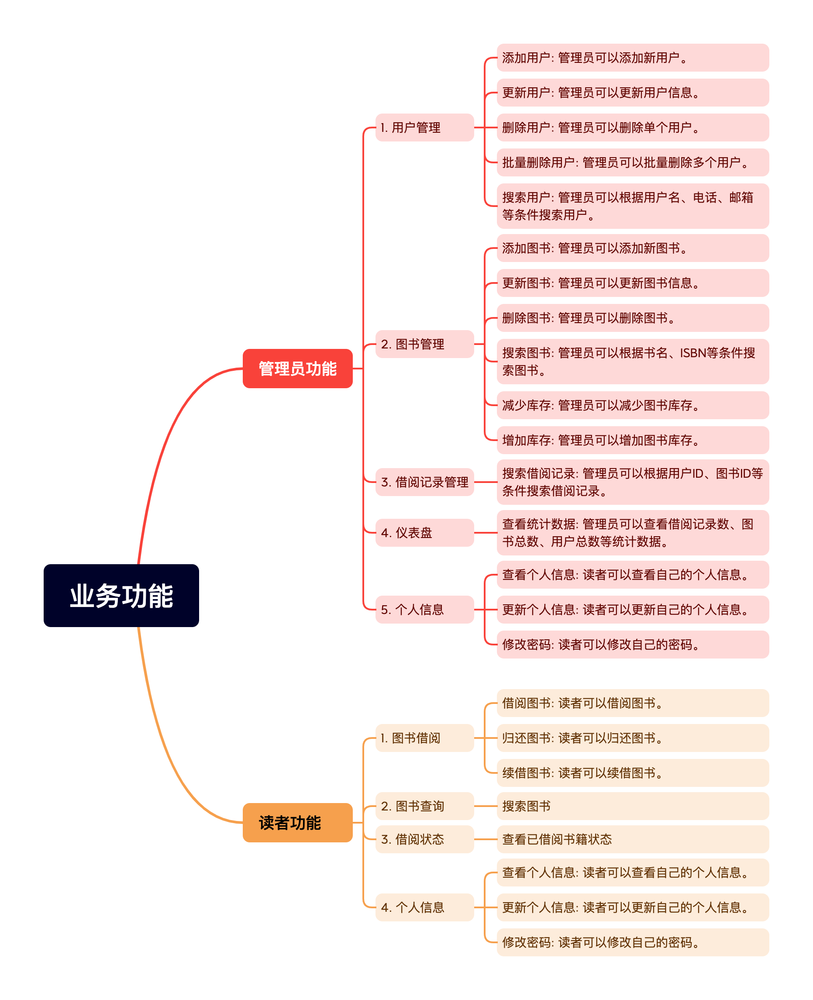

# 业务功能

### 详细功能说明

#### 管理员功能

1. **用户管理**
    - **添加用户**: 管理员可以添加新用户。
    - **更新用户**: 管理员可以更新用户信息。
    - **删除用户**: 管理员可以删除单个用户。
    - **批量删除用户**: 管理员可以批量删除多个用户。
    - **搜索用户**: 管理员可以根据用户名、电话、邮箱等条件搜索用户。

2. **图书管理**
    - **添加图书**: 管理员可以添加新图书。
    - **更新图书**: 管理员可以更新图书信息。
    - **删除图书**: 管理员可以删除图书。
    - **搜索图书**: 管理员可以根据书名、ISBN等条件搜索图书。
    - **减少库存**: 管理员可以减少图书库存。
    - **增加库存**: 管理员可以增加图书库存。

3. **借阅记录管理**
    - **搜索借阅记录**: 管理员可以根据用户ID、图书ID等条件搜索借阅记录。

4. **仪表盘**
    - **查看统计数据**: 管理员可以查看借阅记录数、图书总数、用户总数等统计数据。

#### 读者功能

1. **图书借阅**
    - **借阅图书**: 读者可以借阅图书。
    - **归还图书**: 读者可以归还图书。
    - **续借图书**: 读者可以续借图书。

2. **个人信息**
    - **查看个人信息**: 读者可以查看自己的个人信息。
    - **更新个人信息**: 读者可以更新自己的个人信息。
    - **修改密码**: 读者可以修改自己的密码。

这些功能通过前端页面和后端API进行交互，实现了图书馆管理系统的完整业务流程。

# 项目结构

## 项目结构简介

### 主要技术栈
- **后端**: Spring Boot, MyBatis, JWT, Lombok, MySQL
- **前端**: Vue 3, Vite, Pinia, Vue Router, Element Plus, ECharts, Axios
### 后端（Spring Boot）

#### 目录结构
- **`/src/main/java/dev/wanheng/springbootlibrary`**
    - **`controller`**: 包含 REST API 控制器类，处理与认证、图书、借阅记录、仪表盘统计、用户图书借阅和用户信息管理相关的 HTTP 请求。
    - **`service`**: 包含服务接口和实现类，处理业务逻辑。
        - **`impl`**: 服务接口的实现类。
    - **`config`**: 包含 CORS 和 MybatisPlus 的配置文件。
    - **`dto`**: 数据传输对象，用于在控制器和服务之间传递数据。
    - **`entity`**: 实体类，表示数据库表。
    - **`mapper`**: MyBatis 映射器接口和 XML 文件，定义 SQL 语句和 Java 方法之间的映射。
    - **`security`**: 包含 JWT 和用户详细信息的安全配置类。
    - **`util`**: 工具类，如 `PlainResult`、`JwtUtil` 和 `RoleUtil`。

#### 配置文件
- **`/src/main/resources/application.properties`**: Spring Boot 应用的配置文件，设置应用名称和数据库连接。
- **`/src/main/resources/mapper`**: 包含 MyBatis 的 XML 文件，定义 SQL 语句和 Java 方法之间的映射。

### 前端（Vue 3 + Vite）

#### 目录结构
- **`/library-ui`**
    - **`public`**: 包含渲染用户界面所需的静态资源，如 CSS、字体、图像和 JavaScript 文件。
    - **`src`**: 包含 UI 的源代码。
        - **`assets`**: 全局 CSS 文件和图标。
        - **`components`**: 可重用的 Vue.js 组件。
        - **`layout`**: 布局组件 `Layout.vue`。
        - **`router`**: 路由配置文件 `index.js`，定义 Vue.js 路由和导航守卫。
        - **`store`**: 使用 Pinia 管理用户数据的状态管理。
        - **`views`**: 页面视图组件，如 `Book.vue`、`User.vue`、`Login.vue` 等。
        - **`api`**: API 请求函数，处理与后端的通信。
        - **`App.vue`**: 根组件。
        - **`main.js`**: 应用入口文件，创建 Vue 应用实例并挂载到 DOM。

#### 配置文件
- **`package.json`**: 管理依赖和脚本。
- **`.eslintrc.cjs`**: ESLint 配置文件。
- **`vite.config.js`**: Vite 配置文件。
- **`jsconfig.json`**: JavaScript 配置文件，定义路径别名。

# 代码详情

## 后端功能（Spring Boot）

### REST API 控制器
- **AuthenticationController**: 处理用户注册和登录请求。
- **BookController**: 处理图书的增删改查请求。
- **BorrowRecordController**: 处理借书记录的查询请求。
- **DashboardController**: 提供图书馆统计数据。
- **UserBookController**: 处理用户借书和还书请求。
- **UserController**: 处理用户信息和密码管理请求。

### DTOs（数据传输对象）
- **BookBorrowRequestDto**: 借书请求数据传输对象。
- **BookDto**: 图书数据传输对象。
- **BookReturnRequestDto**: 还书请求数据传输对象。
- **BorrowRecordDto**: 借书记录数据传输对象。
- **LoginDto**: 登录数据传输对象。
- **LoginResponseDto**: 登录响应数据传输对象。
- **RegisterDto**: 注册数据传输对象。
- **UserBorrowBookDto**: 用户借书数据传输对象。
- **UserBorrowBooksInfoDto**: 用户借书信息数据传输对象。
- **UserInfoDto**: 用户信息数据传输对象。
- **UserPasswordChangeDto**: 用户密码修改数据传输对象。

### 实体类
- **Book**: 图书实体类，包含图书的各种属性。
- **BorrowRecord**: 借书记录实体类，包含借书记录的各种属性。
- **User**: 用户实体类，包含用户的各种属性。

### 服务层
- **BookService**: 提供图书管理的业务逻辑。
- **UserService**: 提供用户管理的业务逻辑。
- **BorrowRecordService**: 提供借书记录管理的业务逻辑。

### 映射器
- **BookMapper**: 图书实体与数据库表的映射。
- **BorrowRecordMapper**: 借书记录实体与数据库表的映射。
- **UserMapper**: 用户实体与数据库表的映射。

### 安全功能
- **CustomUserDetailsService**: 从数据库中获取用户详细信息。
- **JwtRequestFilter**: 拦截请求并检查JWT令牌。
- **SecurityBeanConfig**: 定义密码编码和认证管理器。
- **SecurityConfig**: 设置安全过滤链和认证授权规则。

### 配置文件
- **application.properties**: 配置应用名称和MySQL数据库连接。
- **CORS配置**: 允许跨域请求。
- **MybatisPlus配置**: ORM框架配置。

### 工具类
- **PlainResult**: 定义通用的响应对象，包含成功/失败标志和消息。
- **JwtUtil**: 提供提取和验证JWT令牌的方法。
- **RoleUtil**: 提供检查用户角色的方法。

## 前端功能（Vue.js）

### API 请求
- **book.js**: 提供获取、删除、批量删除、更新和保存图书的API请求。
- **user.js**: 提供获取用户信息、更新用户信息、更新用户密码、获取用户列表、删除用户和批量删除用户的API请求。
- **userBooks.js**: 提供借书、还书、续借、获取用户图书、获取用户借书信息和借书记录的API请求。

### 组件
- **Aside.vue**: 定义侧边栏菜单的布局和内容，根据用户角色显示不同的选项。
- **Header.vue**: 显示系统的头部，包括系统Logo和已登录用户的名称，以及一个用于注销的下拉菜单。
- **ValidCode.vue**: 生成随机验证码并以样式化格式显示，支持自定义外观。

### 视图
- **Book.vue**: 图书管理视图，包含搜索栏、表格、分页和添加/编辑/查看逾期图书的对话框。
- **BookWithUser.vue**: 显示用户借阅的图书，提供续借和还书选项。
- **DashBoard.vue**: 显示图书馆的统计数据，包括图书数量、用户数量和借阅图书数量，以及过去一周每天借阅图书数量的折线图。
- **LendRecord.vue**: 显示借阅记录，提供搜索和过滤功能。
- **Login.vue**: 用户登录视图，包含用户名、密码和验证码输入框。
- **Password.vue**: 用户修改密码视图，包含当前密码、新密码和确认新密码的输入框。
- **Person.vue**: 显示和编辑用户个人信息的视图。
- **Register.vue**: 用户注册视图，包含用户名、密码、确认密码、角色和授权码输入框，以及验证码输入框。
- **User.vue**: 显示用户信息的视图，提供编辑和删除用户的选项。

### 路由
- **index.js**: 定义前端应用的路由和导航守卫。

### 状态管理
- **userStore.js**: 定义Pinia store，用于管理用户数据，包括获取用户信息和清除用户信息的功能。

### 样式
- **global.css**: 设置页面元素的默认样式。
- **icon/iconfont.css**: 定义图标样式。
- **style.css**: 定义全局样式，包括字体、表格和分页头部样式，以及动画过渡效果。

## API 接口文档

### 用户相关 API

#### 获取用户信息
- **URL**: `/api/users`
- **方法**: `GET`
- **参数**:
    - `token` (query 参数): 用户的 JWT token
- **响应**: `PlainResult<UserInfoDto>`

#### 更新用户信息
- **URL**: `/api/users/{id}`
- **方法**: `PUT`
- **参数**:
    - `id` (路径参数): 用户 ID
    - `userInfoDto` (请求体): 用户信息 DTO
- **响应**: `PlainResult<Void>`

#### 更新用户密码
- **URL**: `/api/users/password`
- **方法**: `POST`
- **参数**:
    - `userPasswordChangeDto` (请求体): 用户密码更改 DTO
- **响应**: `PlainResult<Void>`

#### 搜索用户
- **URL**: `/api/users/search`
- **方法**: `GET`
- **参数**:
    - `pageNum` (query 参数): 页码
    - `pageSize` (query 参数): 每页大小
    - `name` (query 参数): 用户名
    - `phone` (query 参数): 电话
    - `email` (query 参数): 邮箱
- **响应**: `PlainResult<IPage<UserInfoDto>>`

#### 删除用户
- **URL**: `/api/users/{id}`
- **方法**: `DELETE`
- **参数**:
    - `id` (路径参数): 用户 ID
- **响应**: `PlainResult<Void>`

#### 批量删除用户
- **URL**: `/api/users/deleteBatch`
- **方法**: `POST`
- **参数**:
    - `ids` (请求体): 用户 ID 列表
- **响应**: `PlainResult<Void>`

### 图书相关 API

#### 获取图书列表
- **URL**: `/api/books`
- **方法**: `GET`
- **参数**:
    - `pageNum` (query 参数): 页码
    - `pageSize` (query 参数): 每页大小
    - `title` (query 参数): 图书标题
    - `isbn` (query 参数): 图书 ISBN
- **响应**: `PlainResult<IPage<BookDto>>`

#### 删除图书
- **URL**: `/api/books/{id}`
- **方法**: `DELETE`
- **参数**:
    - `id` (路径参数): 图书 ID
- **响应**: `PlainResult<Void>`

#### 批量删除图书
- **URL**: `/api/books/deleteBatch`
- **方法**: `POST`
- **参数**:
    - `ids` (请求体): 图书 ID 列表
- **响应**: `PlainResult<Void>`

#### 更新图书信息
- **URL**: `/api/books/{id}`
- **方法**: `PUT`
- **参数**:
    - `id` (路径参数): 图书 ID
    - `bookDto` (请求体): 图书信息 DTO
- **响应**: `PlainResult<Void>`

#### 添加图书
- **URL**: `/api/books`
- **方法**: `POST`
- **参数**:
    - `bookDto` (请求体): 图书信息 DTO
- **响应**: `PlainResult<Void>`

### 用户图书借阅相关 API

#### 借阅图书
- **URL**: `/api/user/books/borrow`
- **方法**: `POST`
- **参数**:
    - `bookBorrowRequestDto` (请求体): 图书借阅请求 DTO
- **响应**: `PlainResult<Boolean>`

#### 续借图书
- **URL**: `/api/user/books/borrow/renew`
- **方法**: `POST`
- **参数**:
    - `bookBorrowRequestDto` (请求体): 图书续借请求 DTO
- **响应**: `PlainResult<Boolean>`

#### 归还图书
- **URL**: `/api/user/books/return`
- **方法**: `POST`
- **参数**:
    - `bookReturnRequestDto` (请求体): 图书归还请求 DTO
- **响应**: `PlainResult<Boolean>`

#### 获取用户借阅图书信息
- **URL**: `/api/user/books/info`
- **方法**: `GET`
- **参数**:
    - `userId` (query 参数): 用户 ID
- **响应**: `PlainResult<UserBorrowBooksInfoDto>`

#### 获取用户借阅图书列表
- **URL**: `/api/user/books`
- **方法**: `GET`
- **参数**:
    - `pageNum` (query 参数): 页码
    - `pageSize` (query 参数): 每页大小
    - `title` (query 参数): 图书标题
    - `isbn` (query 参数): 图书 ISBN
    - `userId` (query 参数): 用户 ID
- **响应**: `PlainResult<IPage<BookDto>>`

#### 获取用户借阅记录
- **URL**: `/api/borrow/user/record`
- **方法**: `GET`
- **参数**:
    - `pageNum` (query 参数): 页码
    - `pageSize` (query 参数): 每页大小
    - `isbn` (query 参数): 图书 ISBN
    - `userId` (query 参数): 用户 ID
- **响应**: `PlainResult<IPage<BorrowRecordDto>>`

### 借阅记录相关 API

#### 搜索借阅记录
- **URL**: `/api/borrow/record`
- **方法**: `GET`
- **参数**:
    - `pageNum` (query 参数): 页码
    - `pageSize` (query 参数): 每页大小
    - `isbn` (query 参数): 图书 ISBN
    - `username` (query 参数): 用户名
- **响应**: `PlainResult<IPage<BorrowRecordDto>>`

### 仪表盘统计相关 API

#### 获取统计数据
- **URL**: `/api/dashboard/stats`
- **方法**: `GET`
- **响应**: `PlainResult<Map<String, Object>>`

以上是该项目的 API 文档，涵盖了用户管理、图书管理、用户图书借阅、借阅记录和仪表盘统计等功能。